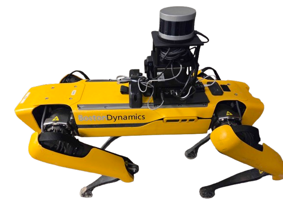
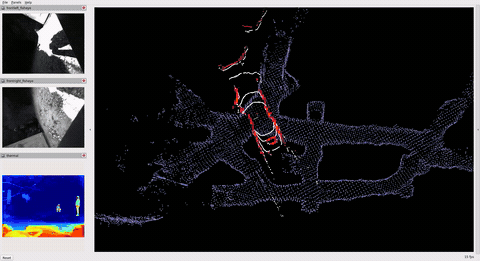

# Spot Edge Navigation

<p align="center">
  
</p>

**[[Project Page]](https://g1y5x3.github.io/spot-edge-nav/) [[Paper]](#citation) [[arXiv]](#citation)**

A fully autonomous navigation stack for the Boston Dynamics Spot quadruped
robot, designed to run entirely on a low-power edge computer (Intel NUC13,
no GPU) in GPS-denied, communication-denied environments such as underground
mines.

The system integrates LiDAR-inertial odometry, scan-matching localization
against a prior map, terrain segmentation, visibility-graph global planning,
and a velocity-regulated local path follower. After a single mapping pass,
the robot can navigate to arbitrary goal locations within the known map
without any learned components or network connectivity.

## Demo

| Mission 1 (Easy, ~11 m) | Mission 2 (Intermediate, ~18 m) |
|:---:|:---:|
|  |  |

| Mission 3 (Deep, ~35 m) | Mission 4 (Return to Entrance) |
|:---:|:---:|
|  |  |

## Architecture

```
VLP-16 + IMU
     │
     ▼
  FAST-LIO2 (LiDAR-Inertial Odometry, 10 Hz)
     │
     ├──► NDT Localization (drift correction against prior map)
     │         │
     │         ▼
     │    /odometry_map (global pose)
     │
     ├──► Terrain Analysis (PMF ground/obstacle segmentation)
     │         │
     │         ▼
     │    /terrain_cloud (traversable points)
     │
     └──────────┐
                ▼
          FAR Planner (visibility-graph global planner, 2.5 Hz)
                │
                ▼
       Regulated Pure Pursuit (local path follower)
                │
                ▼
           /cmd_vel ──► Spot
```

## Hardware

| Component | Model | Notes |
|-----------|-------|-------|
| Robot | Boston Dynamics Spot | |
| Compute | Intel NUC13ANHi7 | i7-1360P (12C/16T), 32 GB RAM, no discrete GPU |
| LiDAR | Velodyne VLP-16 | 10 Hz, 360° FoV |
| IMU | Yahboom | 100 Hz, serial 115200 baud |
| Thermal | TOPDON TC001 | 30 Hz |

## Repository Structure

```
.
├── src/
│   ├── spot_navigation/    # Launch files, configs, goal publishers, benchmark scripts
│   ├── fast_lio/           # FAST-LIO2 LiDAR-inertial odometry
│   ├── ndt_localization/   # NDT scan matching against prior PCD map
│   ├── terrain_analysis/   # PMF ground segmentation + ceiling filter
│   ├── far_planner/        # Visibility-graph global planner
│   ├── mpl_planner/        # Regulated Pure Pursuit local path follower
│   └── velodyne/           # ROS 2 Velodyne VLP-16 driver
├── assets/                 # Photos, demo videos, CAD files
├── Dockerfile              # ROS 2 Humble container
├── docker-compose.yml      # Container orchestration
├── tmux_session.sh         # 3-window tmux layout for field deployment
├── zenoh_host.sh           # Zenoh router (robot side) for remote RViz
└── zenoh_client.sh         # Zenoh client (laptop side)
```

## Setup

### Prerequisites

- Docker and Docker Compose
- (Optional) NVIDIA Container Toolkit for GPU passthrough

### Build

```bash
# Clone with all submodules
git clone --recursive https://github.com/g1y5x3/spot-edge-nav.git
cd spot-edge-nav

# Build and start the Docker container
docker compose up -d
docker compose exec ros-humble-dev bash

# Inside the container: build the workspace
colcon build --cmake-args -DCMAKE_BUILD_TYPE=Release
source install/setup.bash
```

### Persistent Serial Device Names

The IMU and radio are connected as USB serial devices. To avoid `ttyUSB`
ordering changes across reboots, this repo uses persistent udev symlinks:

- udev rules: `src/spot_navigation/config/99-spot-serial.rules`
- IMU default: `src/spot_navigation/launch/sensors.launch.py` uses `/dev/imu_usb`
- radio default: `src/spot_navigation/launch/sensors.launch.py` uses `/dev/radio_usb`

Installed rules:

```udev
SUBSYSTEM=="tty", ENV{ID_SERIAL}=="Silicon_Labs_CP2102_USB_to_UART_Bridge_Controller_0001", SYMLINK+="imu_usb"
SUBSYSTEM=="tty", ENV{ID_SERIAL}=="FTDI_FT232R_USB_UART_BG00JV76", SYMLINK+="radio_usb"
```

Install them on the robot with:

```bash
sudo install -m 0644 src/spot_navigation/config/99-spot-serial.rules /etc/udev/rules.d/99-spot-serial.rules
sudo udevadm control --reload-rules
sudo udevadm trigger
ls -l /dev/imu_usb /dev/radio_usb
```

These rules are expected to work across different machines as long as the same
USB serial adapters are used. If the adapters are replaced, or if multiple
devices expose the same USB identity, update the rule match fields accordingly.

### Launch

The navigation stack is launched in three layers:

```bash
# 1. Sensor drivers + static TF tree
ros2 launch spot_navigation sensors.launch.py

# 2. Localization: FAST-LIO2 + NDT + terrain analysis
ros2 launch spot_navigation lio_localization.launch.py

# 3. Planning: FAR Planner + Pure Pursuit
ros2 launch spot_navigation far_planner.launch.py
```

Or use the tmux script for field deployment (sets up all windows with Zenoh
middleware and workspace sourced):

```bash
./tmux_session.sh
```

### Remote Visualization (Zenoh)

For remote RViz over WiFi (e.g., monitoring from a laptop outside the mine):

```bash
# On the robot
./zenoh_host.sh          # default config
./zenoh_host.sh remote   # downsampled for bandwidth-constrained links

# On the client laptop
source zenoh_client.sh
rviz2
```

## Sending Navigation Goals

Manual goals can be sent from RViz with the `2D Goal Pose` tool, or by running
the route manager with a route YAML.

```bash
# Run the queue-based route manager with a route file
ros2 launch spot_navigation far_planner.launch.py \
  route_manager:=true \
  route_file:=/absolute/path/to/route.yaml
```

## Citation

If you find this work useful, please cite:

```bibtex
@misc{gao2026efficientautonomousnavigationquadruped,
      title={Efficient Autonomous Navigation of a Quadruped Robot in Underground Mines on Edge Hardware},
      author={Yixiang Gao and Kwame Awuah-Offei},
      year={2026},
      eprint={2603.04470},
      archivePrefix={arXiv},
      primaryClass={cs.RO},
      url={https://arxiv.org/abs/2603.04470},
}
```

## License

This project is licensed under the [MIT License](LICENSE).
